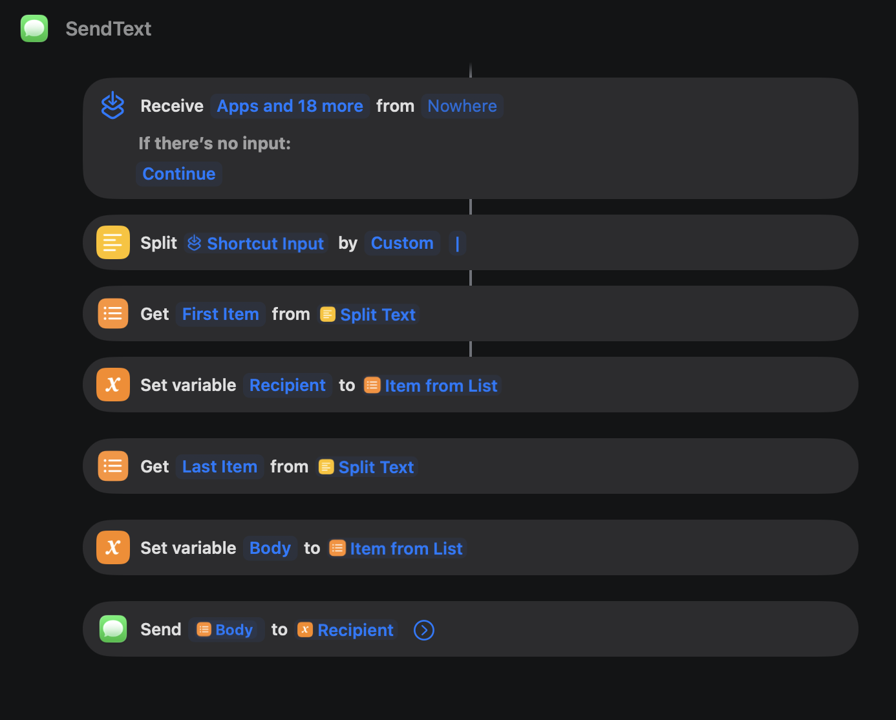

# Build the "SendText" Shortcut (macOS — optional, for the texting skill)

The `sendtext` skill sends iMessage/SMS on your behalf through a macOS **Shortcut** named
**`SendText`**. Shortcuts can't be reliably shipped as a file across machines (they're signed
per-Mac), so you build this once — it's a handful of actions and takes ~2 minutes.

> **Doing this with Claude Code?** Say *"help me build the SendText shortcut"* and it'll walk you
> through it action by action, then test it.

## What it does
It receives one piece of text shaped like `+15551234567|your message`, splits it on the `|` into a
recipient and a body, and sends the message silently (no compose window).

## What the finished shortcut looks like
Build it to match this layout exactly:



## Build it
1. Open the **Shortcuts** app → **+** (new shortcut) → rename it exactly **`SendText`**.
2. Open the shortcut's settings (the **ⓘ** / info button) → make sure it **Receives** input, and set
   **If there's no input: Continue** (as shown in the top block of the screenshot).
3. Add these actions in order (search each by name in the action list on the right):

   | # | Action | Configure |
   |---|--------|-----------|
   | 1 | **Split Text** | Split **Shortcut Input** by **Custom** separator → type a single pipe `\|` |
   | 2 | **Get Item from List** | Get **First Item** from **Split Text** |
   | 3 | **Set Variable** | Set variable **`Recipient`** to that **Item from List** |
   | 4 | **Get Item from List** | Get **Last Item** from **Split Text** |
   | 5 | **Set Variable** | Set variable **`Body`** to that **Item from List** |
   | 6 | **Send Message** | Send **`Body`** to **`Recipient`** |

4. On the **Send Message** action, expand it (the **⌄** chevron) and turn **OFF** "Show When Run"
   (the compose sheet) so it sends silently.

## Test it
In Terminal:
```bash
echo "+1YOURNUMBER|test from the jobhunt kit" | shortcuts run "SendText"
```
Replace `+1YOURNUMBER` with your own cell. Exit code `0` and a text arriving = success.

## Reading your texts (for "catch me up on my texts")
The skill also *reads* your Messages to triage replies. That needs your terminal app (or VS Code,
wherever you run Claude) to have **Full Disk Access**:
- **System Settings → Privacy & Security → Full Disk Access →** add your terminal → toggle on → restart it.

## Turn it on
Set in `~/.jobhunt-kit/profile.yml`:
```yaml
texting:
  enabled: true
  your_number: "+15551234567"
```

## Notes
- Recipients must be **E.164** (`+1XXXXXXXXXX`).
- The message body can't contain a literal `|` (that's the delimiter) — reword if needed.
- iMessage (blue) always works; green-bubble SMS only if your iPhone has Text Message Forwarding on.
